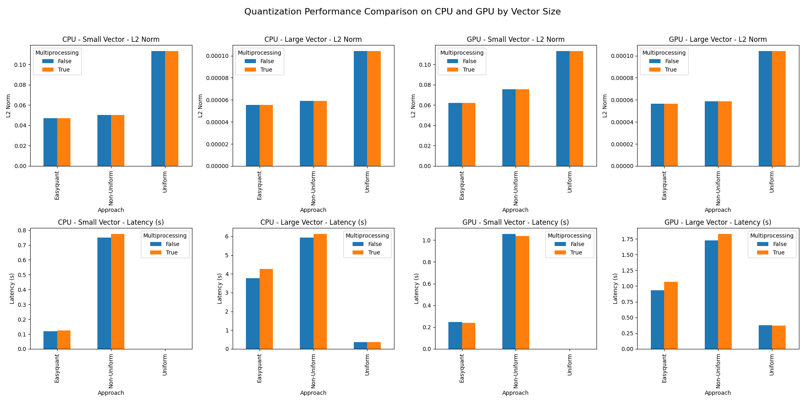

# Quantization Optimization Exercise

## Introduction
This project focuses on the optimization of quantization processes, including uniform, non-uniform, and easy quantization methods. The methods aim to minimize the L2 norm between the original and quantized vectors while handling outliers effectively.

## Requirements
    ```
    Cuda >= 11.0(Optional)
    Python >= 3.6
    Docker(Optional)
    ```

## Installation

### Clone the Repository
```bash
git clone https://github.com/milad1378yz/quantization-optimization-exercise
cd quantization-optimization-exercise
```

### Run with Docker
Navigate to the `docker` directory and run the Docker container:
```bash
cd docker
docker-compose up
```

Attach to the container, and you’re ready to execute the main script directly without needing to install dependencies from `requirements.txt`.

## Usage
Once inside the Docker container, run the main script to start the quantization optimization process:
```bash
python src/main.py
```

### Script Arguments
The main script accepts various arguments to control vector size, quantization approach, device, and more. Here are some of the primary options:
- `--vector_size`: Size of the vector (`small` or `large`). Default is `small`.
- `--approach`: Quantization approach to use (`uniform`, `non-uniform`, `easyquant`, or `all`).
- `--num_bits`: Number of bits for quantization levels.
- `--device`: Device for optimization (`cpu` or `cuda`).
- `--use_multiprocessing`: Enable multiprocessing for large vectors.

### Example
For instance, to run the non-uniform quantization with a large vector, use:
```bash
python src/main.py --vector_size large --approach non-uniform --device cuda
```
To get all of the results, do this:
```bash
chmod +x run_all.sh
./run_all.sh
```

## Results
After each run, the script saves results, including L2 norms and latencies, in the specified `save_dir`. Plots are generated to visualize quantization levels, distributions, and outlier handling.

### Analysis Script
The `src/results_processor.py` script processes the generated `results.txt` and creates a summary image of quantization performance.

#### Script Arguments
- `--input_file`: Path to the `results.txt` file. Default is `results/results.txt`.
- `--output_image`: Path to save the output image. Default is `results/quantization_performance_comparison.png`.

To run the analysis:
```bash
python src/results_processor.py--input_file results/results.txt --output_image results/quantization_performance_comparison.png
```

#### Example of the Output Plot
The following image shows a sample output generated by the analysis script:


